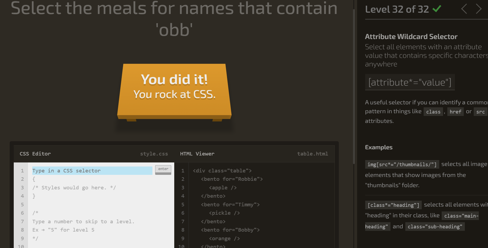

# Week 6: S10 + S11 - February 24 & 26 

# Session 10 

## Review Questions 
**How would you figure out what fonts and colors a website is using?** Inspect and use Devtools. 

**Your external CSS says h1{color:blue;} but your heading is showing up read. What are possible explanations?** There is a direct inline < h1>, more specific selector, or !important rule. 

**Why do we recommend external CSS files over inline styles, even though inline styles win in specificity?** It is easier to read and you can create the same style on each page. 

< div>: Creates a block container(Sections, cards, wrappers)

< span>: Inline container (highlight a word, style part of text)

**Block Elements**: Stack vertically, take full width. Ex. < div>, < p>, < h1>, < ul>, < li>. 

**Inline Elements**: Flow side by side, like words in a sentence. Doesn't accept width/height. Ex. < span>, < a>, < strong>, < img>. 

**Inline-block**: Inline flow, but accepts width/height. Ex. < img>, < button>. 

**None**: Hides elements completely. 

a:hover{
    color: red;
    text-decoration:underline;
}  -> So when you hover your mouse on a link it adds an underline. 

Completed the Game! 
 
